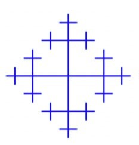
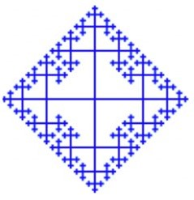
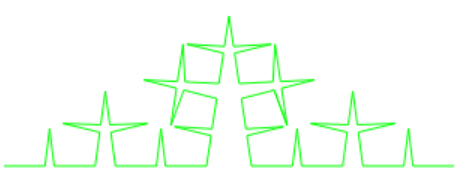
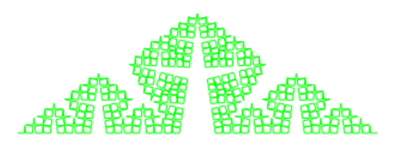
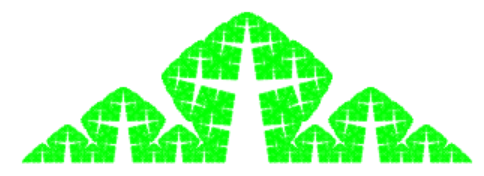
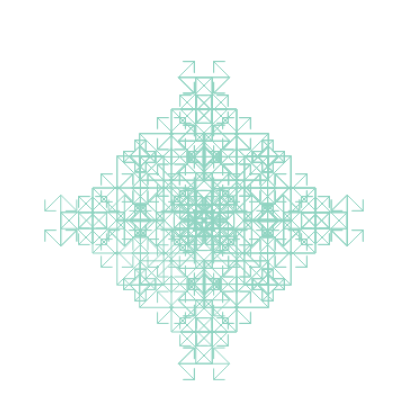
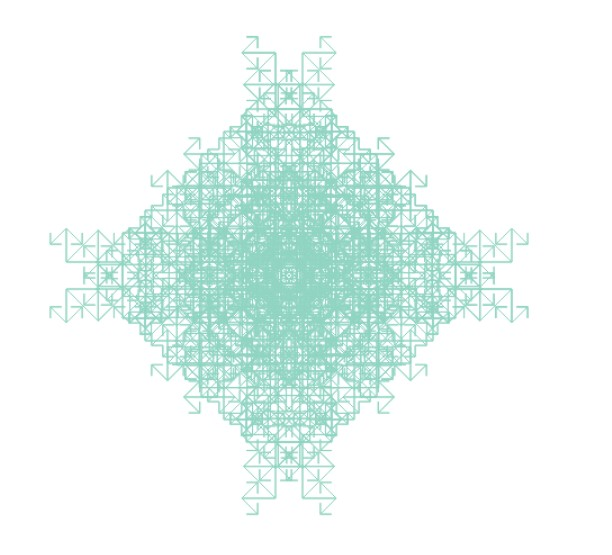
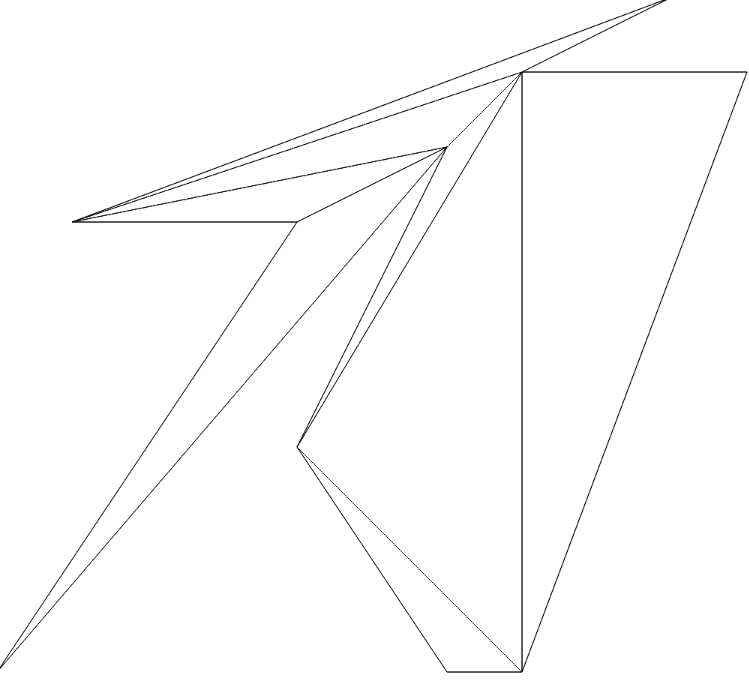
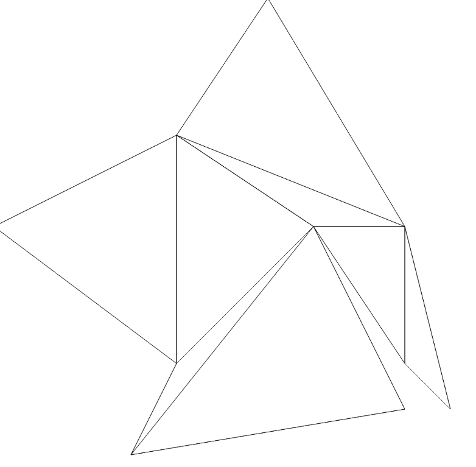
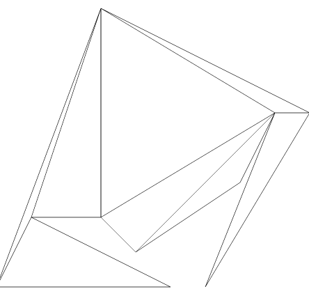

# Programming Assignment 2


# Fractal Drawing
This is an introduction of how to use the p1, p2 and p3.html.
p1, p2 and p3.html draw a fractal shape according to your input that is depth.

## Chapter 1. Input a depth value
If you want to show fractal shape, then Input a value in text box.<br />
There is no limit to input value, but it is recommended that you enter a number less than 15 as possible.<br />
Because if value is greater than 15, probably site will pause. (This is the limit of recursion)

## Chapter 2. Click a draw button
Enter the value in the text box and click the 'draw' button.
Then, the fractal shape will appears on the canvas.
#### <Fractal 1>
depth = 3depth = 5depth = 6

#### <Fractal 2>
depth = 3depth = 5depth = 7

#### <Fractal 3>
depth = 5depth = 8depth = 10

# Polygon with Triangulation
This is an introduction of how to use the p4.html.
p4.html draw a polygon that is simple polygon with triangulation.

## Chapter 1. Input a sentence formed series of points.
Our assumption is Input values are continuous points just linked point to point.<br />
Therefore, You must enter continuous coordinates clockwise or counterclockwise.<br />
Otherwise, an error message will appears because the line that connected the points is not a polygon.
#### Available form
> `(1,1),(2,3),(4,5),(10,4) ...`<br>
> `1,1,2,3,4,5,10,4 ...`<br>
> `1,1,2,3,(4,5),10,4 ...`
#### Unavailable form
If `blank space` is in input text, then an error message will appears that "Invaild form".<br>
> `,,,,,,1,1,2,3,(4,5),10,4 ...`<br>
> `1,1 2,3,,, (4,5) 10,4 ...`

## Chapter 2. Click a draw button
Enter the value in the text box and click the 'draw' button.
Then, the polygon with triagulation will appears on the canvas.
#### <Example 1>&emsp;&emsp;&emsp;&emsp;&emsp;&emsp;&emsp;&emsp;&emsp;&emsp;&emsp;&emsp;&emsp;<Example 2>&emsp;&emsp;&emsp;&emsp;&emsp;&emsp;&emsp;&emsp;&emsp;&emsp;&emsp;&emsp;&emsp;<Example 3>
&emsp;&emsp;&emsp;&emsp;&emsp;&emsp;&emsp;&emsp;&emsp;&emsp;&emsp;&emsp;

# CNF Converter
This is an introduction of how to solve the **CNF converter** problem with C programming.

## Chapter 1. About the contents
1. `CNF converter.c` is C code.
2. `tree.h` is a header file for C code.
3. `input.txt` is an input file.

## Chapter 2. How to set an input.
You can use  `input.txt` with statement.
ex) `input.txt`
``` txt
(or a1 (not (or (not (or a2 a3)) a4)))
```
> `or` is  a disjunction.
> `and` is a conjunction.
> `not` is a negation.
> `aN` is propositional formula ( N is an integer).

## Chapter 3. Summary of C code.
> header file
```c
// tree.h

#ifndef TREE_H
    #define TREE_H
#endif

#include <stdio.h>
#include <string.h>
#include <stdlib.h>

#define MAX_STR 128
#ifdef DEBUG
    #define DPrintf(f) f;
#else
    #define DPrintf(f) ;
#endif

struct Tree{
    int sign; // 0 prop; 1 and; 2 or; 3 not;
    int prop;
    struct Tree *left;
    struct Tree *right;
};
enum SIGN { _NUM, _AND, _OR, _NOT };
struct Tree* newTree(int sign, int prop);
struct Tree* parseToTree(struct Tree* t);
void printTree(struct Tree* t);
struct Tree* doNot(struct Tree* t);
struct Tree* NNF(struct Tree* t);
struct Tree* distribute(struct Tree* t);
struct Tree* CNF(struct Tree* t);
struct Tree* copyTree(struct Tree* t);
void deleteAll(struct Tree* t);
void printAnswer(struct Tree*t);
int checkSyntax(char ss[]);
```
> read input and change to Tree structure
``` c
struct Tree* parseToTree(struct Tree* t){ // close the bracket or demorgan  true: close; false: still open;
    DPrintf(printf("< parseToTree t=%p\n",t));
    char temp;
    char ss[MAX_STR];
    int sign=0;
    int prop=0;

    scanf("%s",ss);
    //checkSyntax(ss);
    DPrintf(printf("- parseToTree temp=%c, ss=%s\n", temp, ss););

    if(ss[0] == '('){

        if(!strcmp(ss,"(and")) sign = _AND;
        else if(!strcmp(ss,"(or"))  sign = _OR;
        else if(!strcmp(ss,"(not")) sign = _NOT;

        t = newTree(sign, prop);
        t->left = parseToTree(t->left);
        if(sign != _NOT)
            t->right = parseToTree(t->right);
    }
    else{
        sign = _NUM;
        prop = ss[1] - '0';
        t = newTree(sign, prop);
    }

    DPrintf(printf("> parseToTree t=%p\n",t));
    return t;
}
```
> newTree
```c
struct Tree* newTree(int sign, int prop){
    DPrintf(printf("< newTree sign=%d, prop=%d\n",sign,prop););
    struct Tree* t = (struct Tree*) malloc(sizeof(struct Tree));

    t->sign = sign;
    t->prop = prop;
    t->left = NULL;
    t->right = NULL;

    DPrintf(printf("> newTree=%p, sign=%d, prop=%d\n", t, sign,prop);
    printf("t=%p, t=%p, t=%p \n\n", t, t->left ,t->right););
    return t;
}
```
>NNF with Demorgan
```c
struct Tree* demorgan(struct Tree* t){
    DPrintf(printf("< demorgan tree=%p\n",t););

    if(t->sign == _NUM) t->prop *= -1;
    else if(t->sign == _AND || t->sign == _OR) {
        t->sign = 3- t->sign;
        t->left = demorgan(t->left);
        t->right = demorgan(t->right);
    }
    else if(t->sign == _NOT) t = t->left;

    DPrintf(printf("> demorgan tree=%p\n",t););
    return t;
}

struct Tree* NNF(struct Tree* t){
    DPrintf(printf("< NNF tree=%p\n",t););

    if(t == NULL){
        //printf("error! nullptr!\n");
        return t;
    }

    if(t->sign == _NOT){ // meet 'demorgan'
        t = demorgan(t->left);
    }
    else if(t->sign==_AND || t->sign==_OR){ // and || or
        t->left = NNF(t->left);
        t->right = NNF(t->right);
    }

    DPrintf(printf("> NNF tree=%p\n",t););
    return t;
}
```
>  CNF with distributive law and copytree
```c
struct Tree* distribute(struct Tree* t){
    DPrintf(printf("< distribute tree=%p\n",t););
    struct Tree* p = NULL;
    struct Tree* pp = NULL;


    if(t->left->sign == 0 && t->right->sign == 0){
        return t;
    }
    else if(t->left->sign == 0){
        p = t->right;
        t->right = NULL;

        pp = p->left;
        p->left = copyTree(t);
        p->left->right = pp;

        pp = p->right;
        p->right = copyTree(t);
        p->right->right = pp;

        deleteAll(t);

        return p;
    }
    else {
        p = t->left;
        t->left = NULL;

        pp = p->left;
        p->left = copyTree(t);
        p->left->left = pp;

        pp = p->right;
        p->right = copyTree(t);
        p->right->left = pp;

        deleteAll(t);

        return p;
    }

    return t;
    DPrintf(printf("> distribute tree=%p\n",t););
}

struct Tree* CNF(struct Tree* t){
    DPrintf(printf("< CNF tree=%p\n",t););

    if(t == NULL || t->sign == 0){
        //printf("error! nullptr!\n");
        return t;
    }

    if(t->sign == 2){ // meet 'or'
        t = distribute(t);
        //t = CNF(t);
    }
    else if(t->sign==1){ // if 'and'
        t->left = CNF(t->left);
        t->right = CNF(t->right);
    }

    return t;

    DPrintf(printf("> CNF tree=%p\n",t););
}

struct Tree* copyTree(struct Tree* t){
    if(t==NULL) return t;

    struct Tree* nt = newTree(t->sign,t->prop);
    nt->left = copyTree(t->left);
    nt->right = copyTree(t->right);
    return nt;
}
}
```
## Chapter 4. How to run
> How to build?
```
gcc -o p2_5.out -include tree.h tree.c
```
In the Debug mode, you can see which functions are executed.

```
gcc -DDEBUG -o p2_5.out -include tree.h tree.c
```
> How to execute?
```
./p2_5.out < input.txt
```
